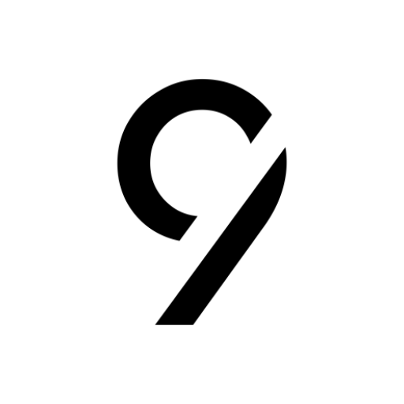
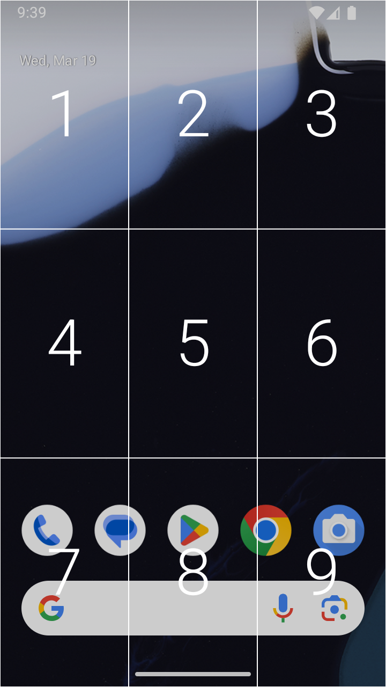
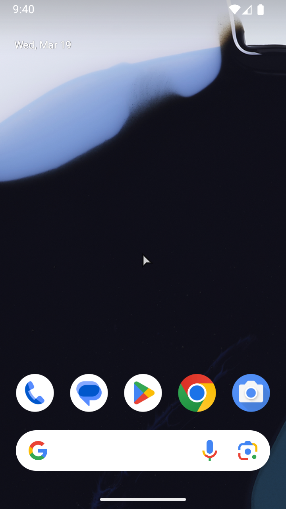
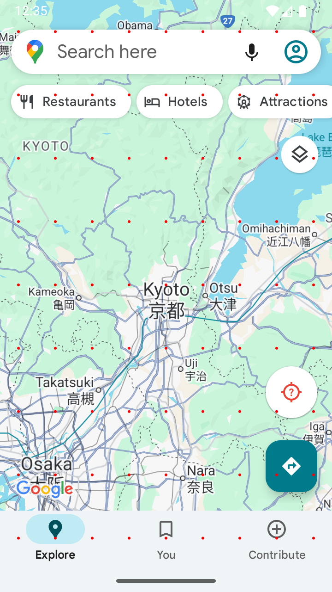
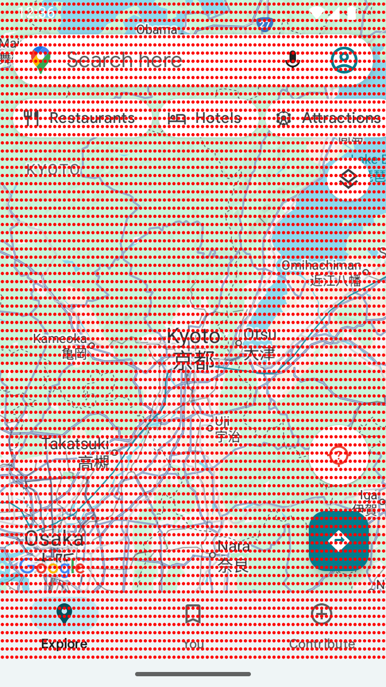
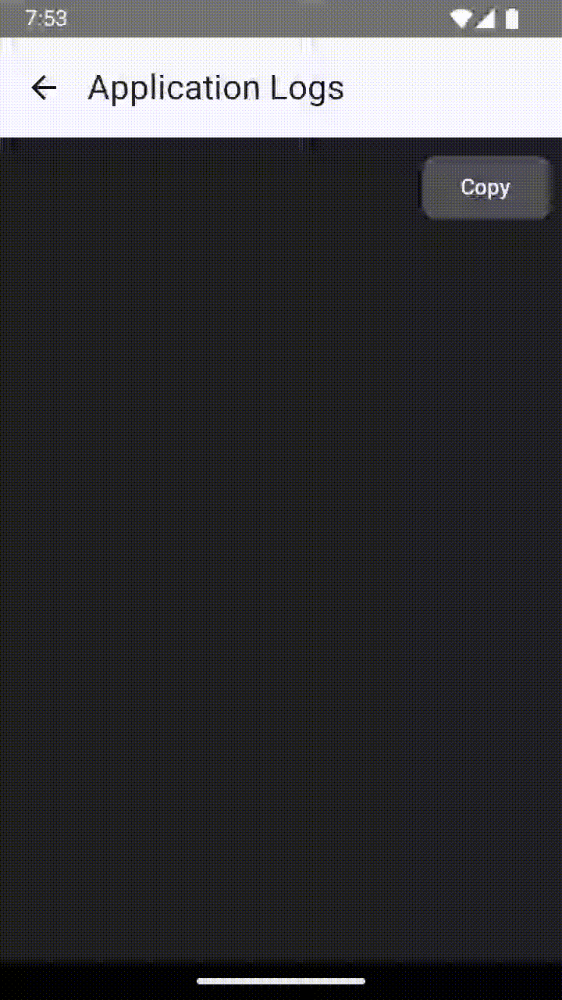
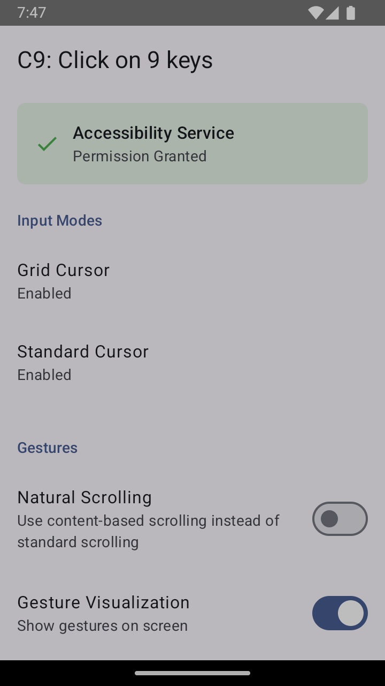
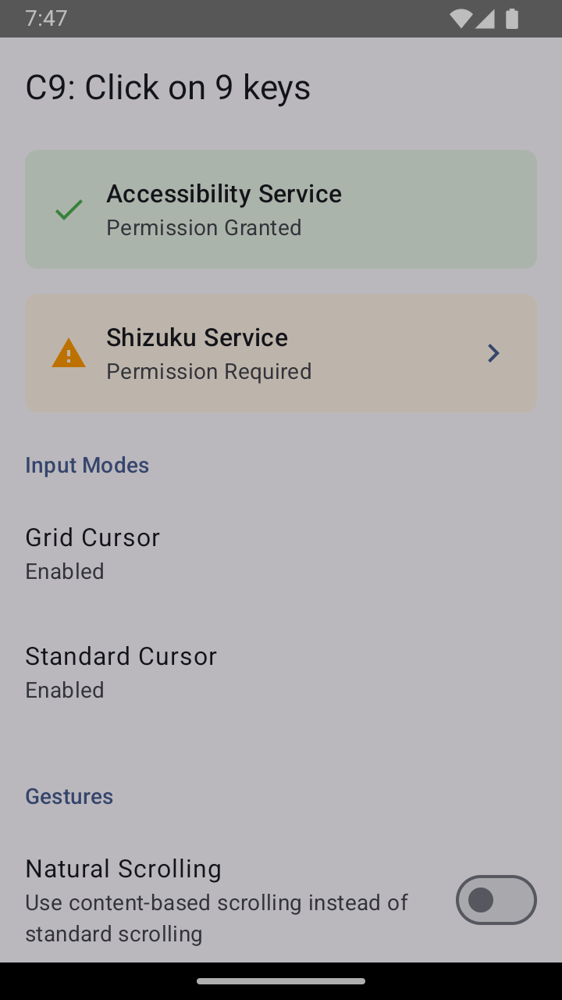
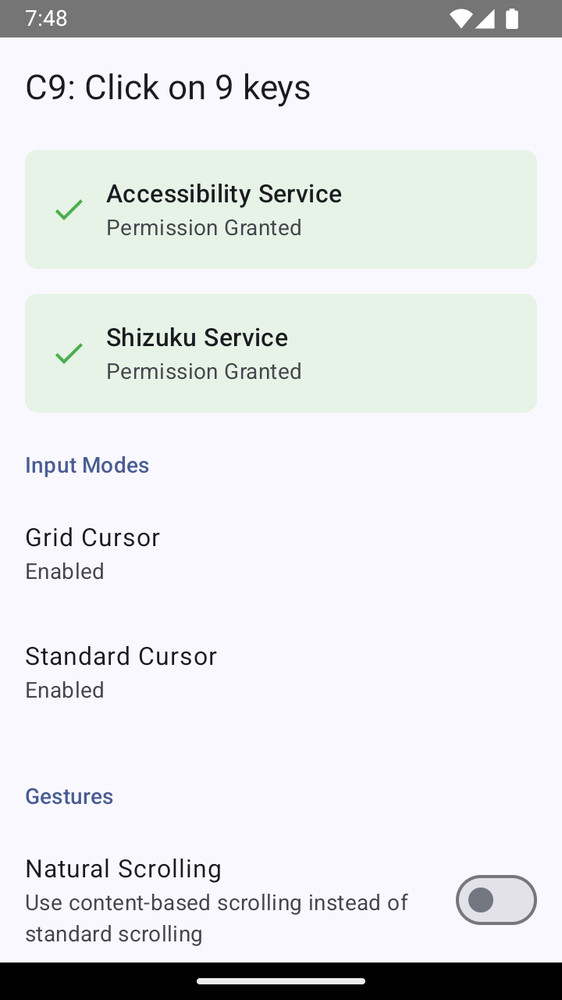

<div align="center">

</div>

---

# C9: Click on 9 keys
   

<div align="center">


</div>

C9 is a dual-cursor application that takes inspiration from T9 to provide clicks using the numpad on Android feature phones. Features of the application include:

- 🌎 Universal Android 7.0+ support via Shizuku as needed
- ⚡ Introduction of a grid cursor focused on efficiency
- 🖱️ Standard cursor to provide a traditional proxy for touchscreen gestures
- ⚙️ Remappable cursor activation keys and integration with button mappers
- 🔀 Translation of key presses into near-native taps, double taps, long press (and drag), scrolling, and zoom
- ✨ Additional quality-of-life features such as cursor auto-hide and landscape orientation support

## Table of Contents
- [Overview](#overview)
  - [Grid Cursor](#grid-cursor)
    - [Instructions](#instructions)
  - [Standard Cursor](#standard-cursor)
    - [Instructions](#instructions-1)
  - [Recommendations](#recommendations)
- [Settings](#settings)
- [Installation](#installation)
- [Device Compatibility](#device-compatibility)
- [Troubleshooting](#troubleshooting)
- [Known Issues](#known-issues)
- [FAQs](#faqs)
- [License](#license)
- [Acknowledgment](#acknowledgments)

## Overview
The majority of modern applications are touch-oriented. The goal of C9 is to mimic the touchscreen gestures required of these applications as closely as possible by adapting button presses in each of the two cursor modes.

Because of their different navigation paradigms, each cursor mode maps gestures uniquely as will be shown below. While both modes can be **enabled** simultaneously (by mapping their activation key or shortcut), only one cursor can be **active** at a time. As a final note, <ins>all buttons in the numpad and D-pad are generally reserved/intercepted while the cursor is active</ins>.

### Grid Cursor
<br />

<div align="center">

</div>

<br />

The grid cursor trades precision for efficiency, taking advantage of the fact that many interactions with UI elements do not require pixel-by-pixel precision. `n` grid levels produce `9^n` points onscreen that can be reached with at most `n` numpad clicks. The visualizations below show the points that can be reached with two grid levels/clicks (81 points), three grid levels/clicks (729 points), and four grid levels/clicks (6561 points).

<br />

<div align="center">



</div>

<br />

#### Instructions
| Action | Mapped buttons | Gesture location | Advances grid | Notes |
| --- | --- | --- | --- | --- |
| Activate/Deactivate | Hold the internal activation key or use a button mapper to map the "Activate Grid Cursor" shortcut. | N/A | N/A | The default internal activation key is the pound (#) key. This can be remapped or unmapped internally. Avoid using buttons in the D-pad or numpad for activation, as they will clash with the gestures below. ||
| Navigate grid | Click numpad 1-9. | The selected number. | True | These buttons rotate with the screen if `C9 > Rotate Buttons With Orientation` is enabled. |
| Reset back to main grid | Press the internal activation key or use a button mapper to map the "Reset Grid" shortcut. | N/A | N/A ||
| Final Tap | Click numpad 1-9 in the final grid level. | The center of the selected number's cell. | True | These buttons rotate with the screen if `C9 > Rotate Buttons With Orientation` is enabled. |
| Tap | Click D-pad center. | If a number is first held, the center of its cell in the current grid. Else, center of the screen. | False ||
| Double Tap | Double click D-pad center. | If a number is first held, the center of its cell in the current grid. Else, center of the screen. | False ||
| Scroll | Click D-pad directions. Hold for continuous scrolling. | If a number is first held, the center of its cell in the current grid. Else, center of the screen. | False | These buttons rotate with the screen if `C9 > Rotate Buttons With Orientation` is enabled.<br /><br />Only one scroll gesture will be dispatched at at time even if the button is press repeatedly unless `C9 > Developer Options > Overlapping Gestures` is enabled. |
| Zoom | Click star (*) and numpad 0. Hold for continuous zooming. | If a number is first held, the center of its cell in the current grid. Else, center of the screen. | False | Zoom distance is not currently user-configurable. |
| Zoom Fallback | Double click D-pad center and hold, followed by a D-pad up or down scroll gesture. | If a number is first held, the center of its cell in the current grid. Else, center of the screen. | False | This corresonds to a one-finger zoom, with a zoom distance determined by `C9 > Scroll Distance`. |

### Standard Cursor

<br />

<div align="center">

</div>

<br />

A standard cursor is included for actions requiring more precision and for those who strictly prefer a traditional pointer. The demo above shows auto-hiding in text fields as well as long press and drag.

#### Instructions
All gestures are dispatched at the tip of the cursor's current location.

| Action | Mapped buttons | Notes |
| --- | --- | --- |
| Activate/Deactivate | Hold the internal activation key or use a button mapper to map the "Activate Standard Cursor" shortcut. | The default internal activation key is the star (*) key. This can be remapped or unmapped internally. Avoid using buttons in the D-pad or numpad for activation, as they will clash with the gestures below. |
| Cursor Movement | Click D-pad directions or numpad 2/4/6/8 (depends on control scheme). | These buttons rotate with the screen if `C9 > Rotate Buttons With Orientation` is enabled. |
| Tap | Click D-pad center or numpad 5. ||
| Double Tap | Double click D-pad center or numpad 5. ||
| Long Press/Drag | Hold D-pad center or numpad 5 to long press, then move cursor to drag. Release D-pad center or numpad 5 to end the gesture. | If `C9 > Auto-Hide Cursor in Text Fields` is enabled, the cursor needs to be manually restored in order to begin a long press/drag. |
| Scroll | Click D-pad directions or numpad 2/4/6/8 (depends on control scheme). Hold for continuous scrolling. | These buttons rotate with the screen if `C9 > Rotate Buttons With Orientation` is enabled.<br /><br />Only one scroll gesture will be dispatched at at time even if the button is press repeatedly unless `C9 > Developer Options > Overlapping Gestures` is enabled. |
| Toggle Move/Scroll | Press the internal activation key or use a button mapper to map the "Toggle Cursor Scroll" shortcut. | This only applies to the control schemes `D-pad` and `Numpad`. |
| Zoom | Numpad 1 and 3. Hold for continuous zooming. | Zoom distance is not currently user-configurable. |
| Zoom Fallback | Double click D-pad center and hold, followed by a D-pad up or down move gesture. | This corresonds to a one-finger zoom, with a zoom distance determined by how much the cursor moves up or down. |

### Recommendations
- For precise clicks, you can use a) grid cursor mode or b) standard cursor with a low cursor speed and high cursor acceleration.
- In the standard cursor mode, both numpad 5 and D-pad center can be used to initiate a long press and drag. It may be easier to use either the numpad or D-pad to initiate the long press and use the other pad to drag.
- Enable `C9 > Gesture Visualization` to learn what each gesture is doing.
- Use `C9 > Auto-Hide Cursor Options` to auto-hide the cursor in select locations. See [Settings](#settings) for more information.
  - Automatic restoration is cancelled if any cursor is manually reactivated. Cursor auto-hide will resume the next time any of the enabled locations is observed.
  - The standard cursor's last position is saved upon restore.
  - `Text Fields` looks for both common and specific keyboard package names. [TT9](https://github.com/sspanak/tt9) is compatible. If this setting does not work for your device, please submit an [issue](https://github.com/austinauyeung/C9/issues) with the name of your keyboard.
- In the standard cursor mode, behavior at the edge of the screen can be set with `C9 > Standard Cursor > Screen Edge Behavior`.
- In the grid cursor mode, quickly navigate to the center of any cell in the current subgrid by pressing that cell's number followed by quick, successive presses of numpad 5.
- When using custom icons for the standard cursor, the following should be noted:
  - The top left of the file corresponds to the cursor's position. A tight crop is recommended.
  - Cursor performance may be impacted by file size and cursor size. If you are experiencing performance issues, try a smaller cursor size and/or compressing the file.
  - Because the file is scaled to fit within a square box, a 1:1 aspect ratio would fit the best, but other aspect ratios can be compensated for by adjusting the cursor size.
- The zoom fallback gestures can be used if an application does not interpret a regular zoom gesture correctly.
- Scroll distance will not exceed the edges of the screen; this behavior can be used on the fly to perform a scroll gesture with a distance smaller than the configured distance.

## Settings
The following settings and `values` are available.

| Category | Setting | Description |
| --- | --- | --- |
| Grid Cursor | Set Activation Key | Sets the grid cursor activation key.<br />Can be cleared if a button mapper is used instead.<br />Can be cleared to disable the grid cursor. |
| | Clear Activation Key | Clears the grid cursor activation key. |
| | Grid Levels | Sets the number of grid levels needed to dispatch a tap. |
| | Persistent Overlay | `On`: Resets back to the main grid after the final tap.<br />`Off`: Deactivates the grid after the final tap. |
| | Overlay Opacity | Sets the opacity of the grid when activated. |
| | Hide Numbers | `On`: Hides the number in each grid cell.<br />`Off`: Shows the number in each grid cell. |
| | Grid Lines | `Show`: Always show grid lines.<br />`Final`: Only show grid lines in the final grid level.<br />`Hide`: Never show grid lines. |
| Standard Cursor | Set Activation Key | Sets the standard cursor activation key.<br />Can be cleared if a button mapper is used instead.<br />Can be cleared to disable the standard cursor. |
| | Clear Activation Key | Clears the standard cursor activation key. |
| | Control Scheme | In the `D-pad` and `Numpad` control schemes, toggling is disabled if `Activation Duration` is `0ms`. Scroll mode is indicated by a screen border indicator with a color determined by the `Cursor Color` setting.<br /><br />`Standard`: Use D-pad to move and numpad to scroll.<br />`Swapped`: Use D-pad to scroll and numpad to move.<br />`D-pad`: Use D-pad to move and scroll. Toggle between the two using the activation key or the button mapper shortcut.<br />`Numpad`: Use numpad to move and scroll. Toggle between the two using the activation key or the button mapper shortcut.<br /> |
| | Screen Edge Behavior | `None`: Cursor remains at the edge of the screen.<br />`Wrap`: Cursor wraps to the opposite side.<br />`Scroll`: Continuously scroll slowly in the direction of the edge. |
| | Cursor Speed | Cursor's base speed without acceleration. Maximum base speed of `10`. |
| | Cursor Acceleration | Cursor's accelerated speed. `0` denotes no acceleration of base speed. Maximum acceleration of `10`. All base speeds have the same maximum accelerated speed. |
| | Cursor Acceleration Start | Duration after which base speed begins accelerating if the cursor is still moving. |
| | Cursor Acceleration Duration | Duration after which accelerated speed is reached after cursor begins acceleration. |
| | Cursor Size | Size of the cursor. |
| | Smooth Cursor Corners | `On`: Round out the corners of the cursor.<br />`Off`: Use default icon. |
| | Cursor Color | Color of the cursor's body with a fixed opacity of `70%`. Specified as a hex value. |
| | Match Border to Body | `On`: Cursor border is set to cursor body color except with `100%`.<br />`Off`: Cursor border is set to black. |
| | Custom Cursor Icons | `On`: Enables user to set custom icons.<br />`Off`: Cursor icon is set to the default icon. |
| | Change Cursor Icon | Opens system picker for file selection and saves the selected file inside the application. Supported formats include png, gif, jpg/jpeg, bmp, and webp. See [Recommendations](#recommendations) for more information. |
| | Cursor Icon Alignment | `Top left`: Cursor is aligned to the top-left of the cursor icon.<br />`Center`: Cursor is aligned to the center of the cursor icon. |
| | Clear Cursor Icon | Deletes the saved file from the application and falls back to the default cursor icon. |
| | Change Scroll Toggle Icon | This setting is enabled only for the `D-pad` and `Numpad` control schemes and applies to their scroll mode.<br /><br />Opens system picker for file selection and saves the selected file inside the application. Supported formats include png, gif, jpg/jpeg, bmp, and webp. See [Recommendations](#recommendations) for more information. |
| | Scroll Toggle Icon Alignment | `Top left`: Cursor is aligned to the top-left of the scroll toggle icon.<br />`Center`: Cursor is aligned to the center of the scroll toggle icon. |
| | Clear Scroll Toggle Icon | This setting is enabled only for the `D-pad` and `Numpad` control schemes and applies to their scroll mode.<br /><br />Deletes the saved file from the application and falls back to the default screen border indicator. |
| Auto-Hide Cursor Options | Text Fields | `On`: Hide the cursor when a text field opens a keyboard, and restore the cursor when the keyboard closes.<br />`Off`: Never auto-hide the cursor in text fields. |
| | Lock Screen | This setting applies only when a screen lock has been configured.<br /><br />`On`: Hide the cursor when the device locks, and restore the cursor when the device unlocks.<br />`Off`: Never auto-hide the cursor in the lock screen. |
| | Select Applications | Allows auto-hide on any application in the app drawer plus the stock launcher. |
| Common Gesture Options | Gesture Style | `Fixed 1`: Scrolls are controlled and fixed distance. In non-Shizuku scrolling, this may work better on media and in other places.<br />`Fixed 2`: Enforces fixed distance scrolling more strongly than `Fixed 1`. In non-Shizuku scrolling, this may work better in browsers and other places. Not applicable when Shizuku integration is enabled.<br />`Inertia`: Scrolls resemble flicks.<br /> |
| | Gesture Visualization | `On`: Show visualizations for all gestures.<br />`Off`: Hide all visualizations. |
| | Gesture Visualization Size | Size of visualization icon. |
| Scroll Options | Natural Scrolling | `On`: Pressing up will cause content to scroll down, etc.<br />`Off`: Pressing up will cause content to scroll up, etc. |
| | Scroll Duration | Duration of scroll gestures. The standard cursor's `Scroll` screen edge behavior defaults to the maximum of this range. |
| | Scroll Distance | Distance scrolled in proportion to the corresponding axis.<br />Example: If set to `50%` and when scrolling up, the cursor will attempt to scroll 50% of the screen's height but will not exceed the top of the screen. |
| | Advanced Scrolling | `On`: Enables settings to accelerate continuous scrolling decelerate edge scrolling.<br />`Off`: Returns continuous scrolling and edge scrolling to their default behavior and hides their settings. |
| | Continuous Scroll Duration | This setting requires `Advanced Scrolling` to be enabled.<br /><br />Duration of scroll gestures during continuous scrolling. This is <ins>upper bounded</ins> by `Scroll Duration` for accelerated scrolling. |
| | Continuous Scroll Distance | This setting requires `Advanced Scrolling` to be enabled.<br /><br />Distance scrolled in proportion to the corresponding axis during continuous scrolling. This is <ins>lower bounded</ins> by `Scroll Distance` for accelerated scrolling. |
| | Acceleration Start | Duration after which scroll duration and scroll distance begin accelerating towards continuous scroll duration and continuous scroll distance, respectively, once continuous scrolling is active. |
| | Acceleration Duration | Duration after which continuous scroll duration and continuous scroll distance are reached after scrolling begins acceleration. |
| | Edge Scroll Duration | This setting requires `Advanced Scrolling` to be enabled and the standard cursor's screen edge behavior set to `Scroll`.<br /><br />Duration of scroll gestures during edge scrolling. This is <ins>lower bounded</ins> by `Scroll Duration` for decelerated scrolling. |
| | Edge Scroll Distance | This setting requires `Advanced Scrolling` to be enabled and the standard cursor's screen edge behavior set to `Scroll`.<br /><br />Distance scrolled in proportion to the corresponding axis during edge scrolling. This is <ins>upper bounded</ins> `Scroll Distance` for decelerated scrolling. |
| Zoom Options | Zoom Duration | Duration of zoom gestures. |
| General | Activation Duration | Duration until cursor (de)activation. Does not apply to third-party button mappers.<br /><br />If set to `0ms`, the buttons used for activation will be completely intercepted by this application, and the following features will be disabled: [`Reset back to main grid`](#instructions) in the grid cursor and [`Toggle Move/Scroll`](#instructions-1) in the standard cursor.
| | Rotate Buttons With Orientation | `On`: Rotate the D-pad and numpad along with the screen. <br />`Off`: D-pad and numpad behave as though the screen is always in portrait mode. |
| Developer Options | Collect Logs | `On`: Saves logs internally.<br />`Off`: No logs are saved, and existing logs are cleared. |
| | Log Screen | If `Collect Logs` is enabled, the log screen will display the saved logs. |
| | Enable Shizuku Integration | `On`: Cursor will authorize with Shizuku and, if authorized, dispatch gestures using Shizuku.<br />`Off`: Cursor will use the default gesture dispatch. |
| | Overlapping Gestures | This setting applies only to manual gestures, not those dispatched during a continuous gesture via a held button.<br /><br />`On`: New scrolls and zooms can be immediately dispatched before any prior gesture ends. Currently not recommended for use with Shizuku.<br />`Off`: Scroll and zoom button presses are ignored until any prior gesture ends. |
| | Improve Non-Shizuku Gestures | This setting does not apply if Shizuku is active, and it is recommended only for Android versions 8-10 if poor gesture performance is observed.<br /><br />`On`: Scrolls and zooms become smoother at the expense of possible stutter.<br/>`Off`: Cursor will use the default gesture dispatch. |
| | Use Physical Size | `On`: Cursor will use the screen's physical dimensions to overlay.<br />`Off`: Cursor will not overlay on top of any navigation bars. |
| | Allow Passthrough | `On`: Cursor will not intercept key presses. Not recommended.<br />`Off`: Cursor intercepts key presses. Default behavior. |

## Installation
The latest version can be found under [releases](https://github.com/austinauyeung/C9/releases). You can use GitHub's `Watch > Custom > Releases` option to be notified of new releases.

### Option 1
Install using the standard package installer. Allow the accessibility service using the banner in the application.

### Option 2
Install using adb:
```
>> adb install path/to/apk
>> adb shell settings put secure enabled_accessibility_services com.austinauyeung.nyuma.c9/com.austinauyeung.nyuma.c9.accessibility.service.OverlayAccessibilityService
```

### Additional installation for certain Android versions
Refer to the following table to determine if you will need to [install Shizuku](https://shizuku.rikka.app/guide/setup/) to use this application:

| Android Version | Shizuku Required | Notes |
| --- | --- | --- |
| 7 | Yes | Shizuku is needed specifically to support features such as long press and drag. |
| 8, 9, 10 | Maybe | If you are experiencing poor ("blocky") scroll and zoom performance, first try `C9 > Developer Options > Improve Non-Shizuku Gestures`, which will attempt to dispatch smoother gestures but may stutter. For the most optimal gestures, Shizuku is needed. |
| 11 | Maybe | Shizuku is needed if the application does not work as-is (i.e. no gestures can be dispatched) and/or you have had trouble in the past with other cursor apps. |
| 12+ | No | |

Once installed, navigate to, and enable, `C9 > Developer Options > Enable Shizuku Integration`.

Note that unless your device is rooted, you will need to restart the Shizuku service upon reboot.

## Device Compatibility
The following devices have been confirmed by users and is not exhaustive.
| Brand | Models | Notes |
| --- | --- | --- |
| ALT | `MIVE Style Folder` `MIVE Style Folder 2` | |
| CAT | `S22 Flip` | |
| Doro | `7080` | |
| Freetel | `Mode 1 Retro II` | | 
| Kyocera | `Cadence S2720` `Digno Keitai 4 A202KC` `DuraXE Epic E4830` `DuraXV Extreme E4810` `DuraXV Extreme+ E4811` `Gratina KYF42` | |
| LG | `X100S` | |
| Sharp | `Aquos SH-02L` `Aquos Keitai 3 805SH` | The `Aquos SH-02L` may need Shizuku if running Android 8. | 
| Sonim | `XP3 Plus XP3900` | The `XP3 Plus XP3900` may need Shizuku if running Android 11. |
| TCL | `Flip 2` | The `Flip 2` may need Shizuku if running Android 11. |
| Vortex | `V3` | See [Known Issues](#known-issues). |
| Xiaomi | `Qin F21 Pro` `Qin F22 Pro` | |

## Troubleshooting
### Generating cursor logs
<div align="center">

</div>

If gestures do not work as expected, logs can be generated to help identify and fix any issues. Enable `C9 > Developer Options > Collect Logs`, duplicate the issue, and copy the logs in `C9 > Developer Options > Log Screen` and submit a GitHub issue. The example logs below correspond to the screen recording above.

```
--- SYSTEM INFORMATION ---
Device: Google sdk_gphone64_x86_64
Android Version: 15 (SDK 35)
Screen: 720 x 1232 pixels (density 2.0)

--- USER SETTINGS ---
...

--- LOG ENTRIES ---
[19:53:58.362] [D] Key event: KeyEvent { action=ACTION_DOWN, keyCode=KEYCODE_EQUALS, scanCode=13, metaState=0, flags=0x8, repeatCount=0, eventTime=14387767052000, downTime=14387767052000, deviceId=0, source=0x301, displayId=-1 }
[19:53:58.665] [D] Overlay mode changed: NONE -> CURSOR
[19:53:58.669] [D] Cursor state changed: true
[19:53:58.682] [D] Overlay view created and added to window manager
[19:53:58.886] [D] Key event: KeyEvent { action=ACTION_UP, keyCode=KEYCODE_EQUALS, scanCode=13, metaState=0, flags=0x8, repeatCount=0, eventTime=14388291421000, downTime=14387767052000, deviceId=0, source=0x301, displayId=-1 }
[19:53:59.716] [D] Key event: KeyEvent { action=ACTION_DOWN, keyCode=KEYCODE_ENTER, scanCode=28, metaState=0, flags=0x8, repeatCount=0, eventTime=14389121655000, downTime=14389121655000, deviceId=0, source=0x301, displayId=-1 }
[19:53:59.717] [D] Starting tap gesture at (360.0, 640.0)
[19:53:59.718] [D] DefaultGestureStrategy: starting tap at (360.0, 640.0)
[19:53:59.718] [D] Gesture paths changed: 1 paths
[19:53:59.746] [D] DefaultGestureStrategy: start tap completed successfully
[19:53:59.771] [D] Gesture paths changed: 0 paths
[19:53:59.798] [D] Key event: KeyEvent { action=ACTION_UP, keyCode=KEYCODE_ENTER, scanCode=28, metaState=0, flags=0x8, repeatCount=0, eventTime=14389190365000, downTime=14389121655000, deviceId=0, source=0x301, displayId=-1 }
[19:53:59.799] [D] Ending tap at (360.0, 640.0)
[19:53:59.799] [D] DefaultGestureStrategy: ending tap at (360.0, 640.0)
[19:53:59.808] [D] DefaultGestureStrategy: end tap completed successfully
[19:54:01.307] [D] Key event: KeyEvent { action=ACTION_DOWN, keyCode=KEYCODE_EQUALS, scanCode=13, metaState=0, flags=0x8, repeatCount=0, eventTime=14390712608000, downTime=14390712608000, deviceId=0, source=0x301, displayId=-1 }
[19:54:01.609] [D] Overlay mode changed: CURSOR -> NONE
[19:54:01.612] [D] Cursor state changed: false
[19:54:01.626] [D] Overlay view removed
[19:54:01.875] [D] Key event: KeyEvent { action=ACTION_UP, keyCode=KEYCODE_EQUALS, scanCode=13, metaState=0, flags=0x8, repeatCount=0, eventTime=14391281290000, downTime=14390712608000, deviceId=0, source=0x301, displayId=-1 }
[19:54:02.231] [D] Key event: KeyEvent { action=ACTION_DOWN, keyCode=KEYCODE_DPAD_RIGHT, scanCode=106, metaState=0, flags=0x8, repeatCount=0, eventTime=14391636575000, downTime=14391636575000, deviceId=0, source=0x301, displayId=-1 }
[19:54:02.322] [D] Key event: KeyEvent { action=ACTION_UP, keyCode=KEYCODE_DPAD_RIGHT, scanCode=106, metaState=0, flags=0x8, repeatCount=0, eventTime=14391727695000, downTime=14391636575000, deviceId=0, source=0x301, displayId=-1 }
[19:54:02.869] [D] Key event: KeyEvent { action=ACTION_DOWN, keyCode=KEYCODE_DPAD_RIGHT, scanCode=106, metaState=0, flags=0x8, repeatCount=0, eventTime=14392275611000, downTime=14392275611000, deviceId=0, source=0x301, displayId=-1 }
[19:54:02.950] [D] Key event: KeyEvent { action=ACTION_UP, keyCode=KEYCODE_DPAD_RIGHT, scanCode=106, metaState=0, flags=0x8, repeatCount=0, eventTime=14392344310000, downTime=14392275611000, deviceId=0, source=0x301, displayId=-1 }
[19:54:03.460] [D] Key event: KeyEvent { action=ACTION_DOWN, keyCode=KEYCODE_ENTER, scanCode=28, metaState=0, flags=0x8, repeatCount=0, eventTime=14392865662000, downTime=14392865662000, deviceId=0, source=0x301, displayId=-1 }
[19:54:03.507] [D] Key event: KeyEvent { action=ACTION_UP, keyCode=KEYCODE_ENTER, scanCode=28, metaState=0, flags=0x8, repeatCount=0, eventTime=14392912821000, downTime=14392865662000, deviceId=0, source=0x301, displayId=-1 }

```

### Verifying Shizuku authorization
A green banner on the main page indicates that Shizuku authorization has been granted to C9. Only the third screenshot below indicates successful authorization.
<div align="center">



</div>

### Cursor does not deactivate
If you are unable to deactivate the cursor, clear the internal activation key, which unmaps that cursor and hides any active cursor, even if it was activated using a button mapper.

## Known Issues
- On the Vortex V3, the numpad backlight may not function when the cursor is active.
  - This is likely due to a firmware limitation in the phone as well as the cursors' interception of key presses. There is an experimental setting "Allow Passthrough" that may fix this at the expense of unintended behavior in the underlying application.

## FAQs
### Where can I make feature suggestions or report bugs?
You can use the [issues](https://github.com/austinauyeung/C9/issues) tab for both. For bugs, please provide logs [using the built-in logger](#generating-cursor-logs) or `adb logcat C9App:V *:S`.

### How else can I contribute?
Please feel free to submit a pull request, create a video walkthrough, [confirm your device's compatibility](#device-compatibility), or provide anything else you think would be helpful!

### What is Shizuku?
Shizuku allows applications in general to perform actions that require elevated privileges. In C9, it is required to dispatch gestures on Android 11 using [InputManager](https://developer.android.com/reference/android/hardware/input/InputManager) instead of the standard dispatch using [AccessibilityService](https://developer.android.com/reference/android/accessibilityservice/AccessibilityService).

### What does it mean for the cursor to intercept button presses?
The cursors sit between your button presses and the underlying application. If a button is used by the cursor, the cursor will consume it and prevent the underlying application from receiving the button press.

### What does C9 stand for?
Officially, it stands for "Click on 9 keys" as homage to T9's "Text on 9 keys". 

Unofficially, I think it now encapsulates these 9 goals and themes:
- Cursor paradigms
- Cascading grid cursor
- Continuity with modern applications
- Context-aware auto-hide
- Compatibility across Android versions
- Customization options
- Compact size
- Convenience
- Community

The last one is especially important as this application has become a product of feedback from the dumbphone/flipphone community. Thank you to those who have used C9!

Finally, there's the saying that cats have nine lives. As the [package name](#option-2) would suggest, this application is dedicated to my late cat, [Nyuma](./docs/imgs/IMG_3226.jpg).

## License
[Apache License Version 2.0](./LICENSE)

## Acknowledgments
- Allegra and [Arlie](./docs/imgs/IMG_5199.jpg) for their support
- Everyone on the [releases](https://github.com/austinauyeung/C9/releases) page for their feature suggestions and bug reports
- `sam-club` for extensive initial testing
- `Dev-in-the-BM` for initial testing and the Shizuku suggestion
- `anonymousfliphones` for initial testing
